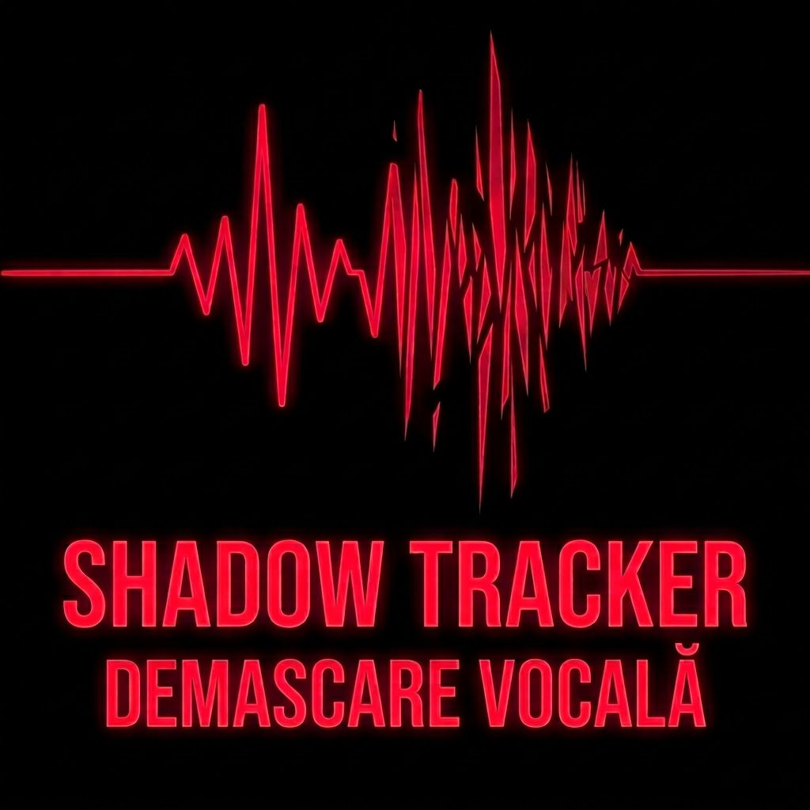

# 🕵️‍♂️ SHADOW TRACKER v1.0 | Audit Vocal Biometric

**Shadow Tracker** este un instrument avansat de analiză a micro-trepidațiilor vocale, conceput pentru a detecta stresul, ezitarea și anomaliile biometrice în timp real. Dezvoltat sub egida **Sâmbătă la opt**, acest sistem aduce adevărul la suprafață acolo unde cuvintele încearcă să îl ascundă.

## 🚀 Funcționalități
- **Analiză Spectrală Live:** Vizualizarea undelor sonore în spectrul Crimson.
- **Detecție Stres Biometric:** Algoritm de monitorizare a frecvențelor laringeale corelate cu stările de tensiune.
- **Interfață Obsidian:** Design minimalist, optimizat pentru concentrare și analiză lucidă.
- **Protocol PRO:** Acces nelimitat pentru utilizatorii verificați.

## 🛠️ Instrucțiuni de Utilizare
1. Accesează aplicația prin GitHub Pages.
2. Permite accesul la microfon pentru inițierea scanării.
3. Observă variațiile undei: o linie stabilă indică un semnal biometric calm; exploziile și anomaliile indică stres ridicat.

## 🔐 Activare Licență PRO
După atingerea limitei de 30 de scanări gratuite:
1. Efectuează plata prin portalul securizat **PayPal**.
2. Solicită codul de activare prin butonul dedicat din aplicație.
3. Introdu codul primit pe email pentru a debloca **Protocolul Nelimitat**.

---
*„Umbra nu minte niciodată. Noi doar o facem vizibilă.”*
**Sâmbătă la opt.**
